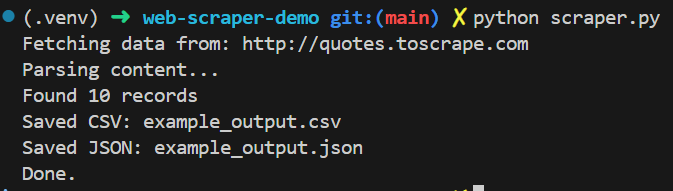

# Python Web Scraper Demo

A clean Python scraping demo that extracts structured website data and exports it to CSV and JSON.

## What this project does

This script scrapes quote data from a demo website and saves the extracted information in two structured output formats:

- CSV
- JSON

The scraper collects:

- Quote text
- Author
- Tags

## Features

- Built with Python
- Uses Requests and BeautifulSoup
- Exports data to CSV and JSON
- Simple command-line usage
- Clean project structure
- Ready for portfolio presentation

## Project Structure

```text
web-scraper-demo/
├── scraper.py
├── requirements.txt
├── README.md
├── example_output.csv
├── example_output.json
└── .gitignore

## Installation

git clone https://github.com/Lopicic-J/web-scraper-demo.git
cd web-scraper-demo
python3 -m venv .venv
source .venv/bin/activate
pip install -r requirements.txt

## Usage:

Run the scraper:
python scraper.py

## Output:

The script generates:
- example_output.csv
- example_output.json

## Example Use Case

This is a simple example of a freelance scraping task where website data is extracted and delivered in a structured format for further use.

Typical client use cases:

- website data extraction
- product or content collection
- CSV dataset creation
- JSON export for automation workflows

## Skills Demonstrated

- Python scripting
- Web scraping
- HTML parsing
- CSV export
- JSON export
- Data extraction workflow

## Committen


## Danach committen

```bash
git add README.md
git commit -m "Improve README for portfolio presentation"
git push

## Preview



git add README.md screenshots
git commit -m "Add portfolio screenshots to README"
git push